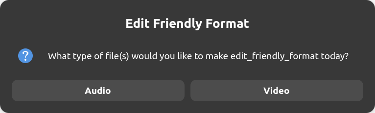
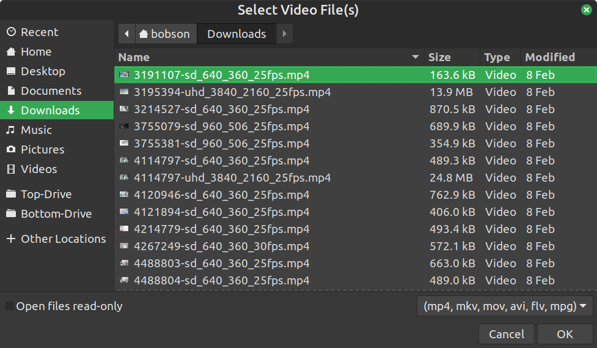
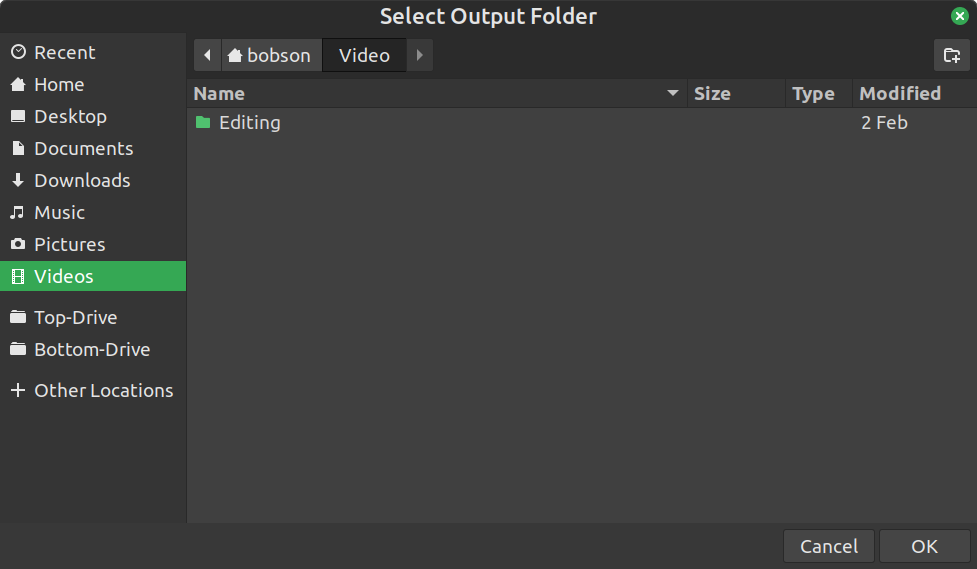
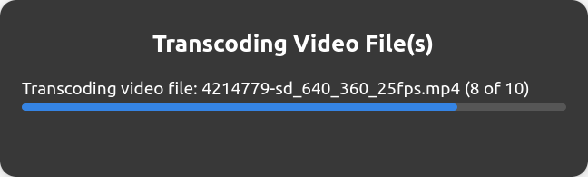
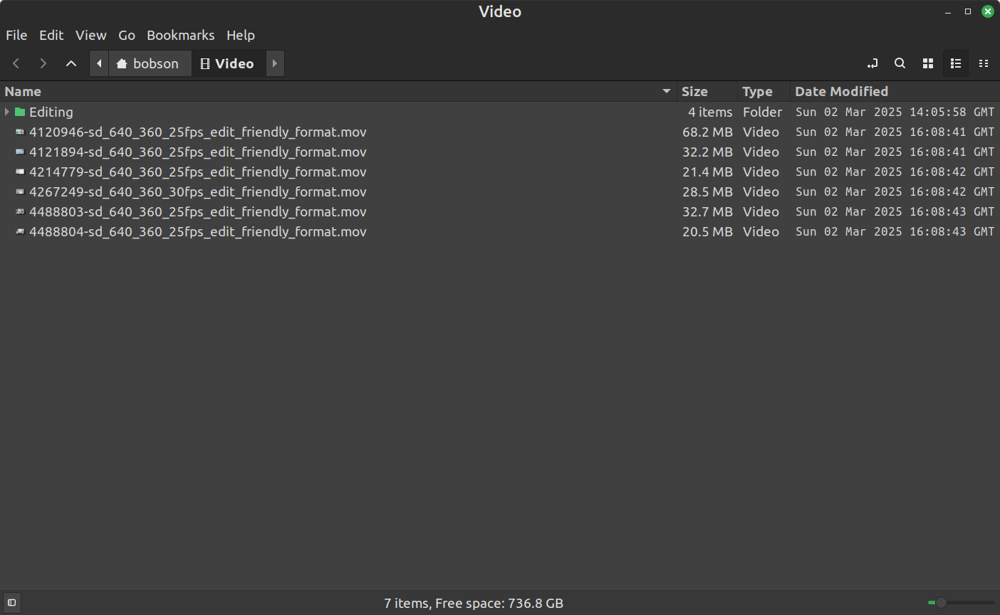
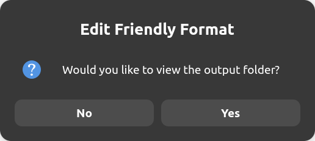
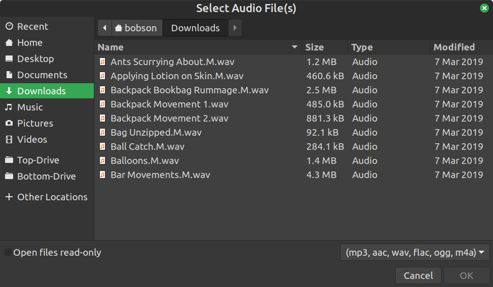
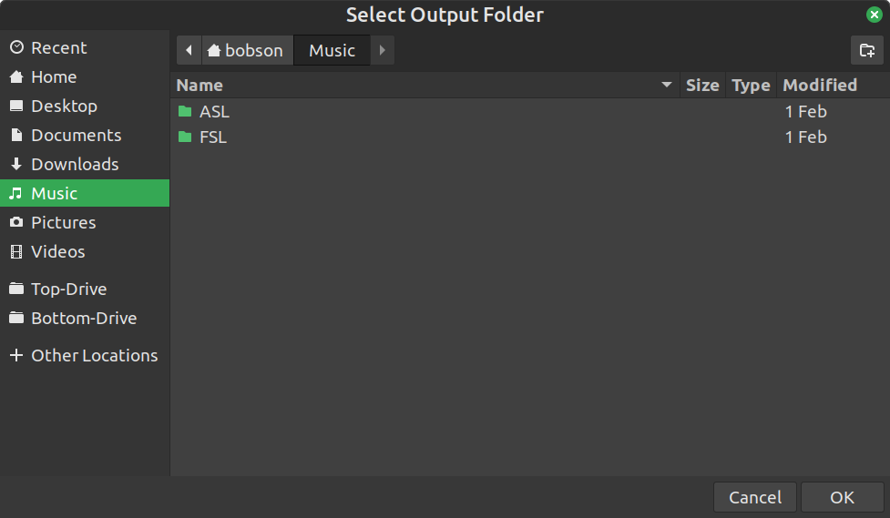
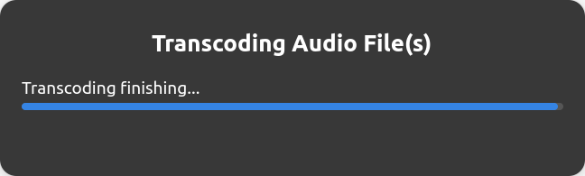
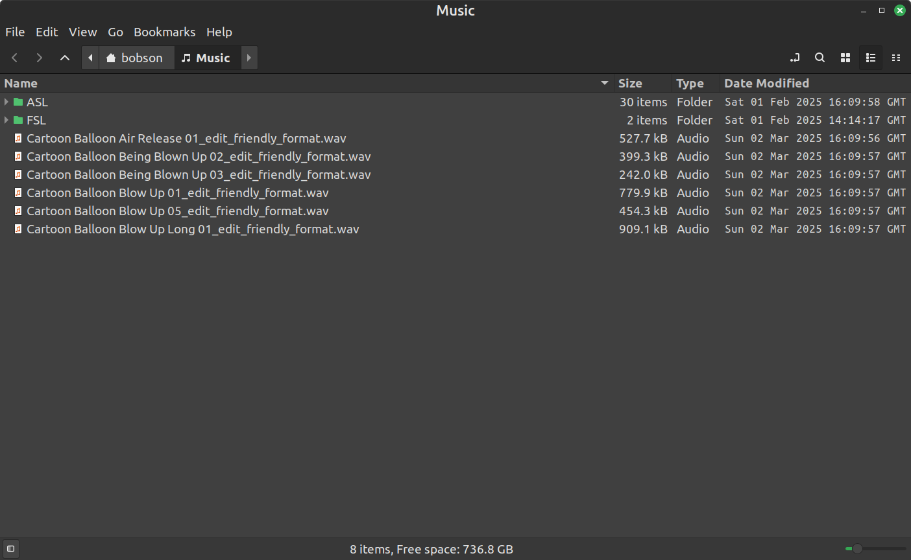

<h1>Edit Friendly Format</h1>

    

<h2>Intro</h2>

    
Edit Friendly Format is a Flatpak application that simplifies media editing by offering a suite of easy-to-use shell scripts for audio and video processing. Built with flexibility in mind, this project provides a unified workflow for transcoding media file(s) into an Edit Friendly Format. (**edit_friendly_format**)

<h2>Key Features</h2>

- Audio Processing 
- Video Processing
- Unified Workflow

<h2>Technical</h2>

Edit Friendly Format uses **ffmpeg** to transcode video file(s) into **DNxHR_HQ** video codec with **pcm_s24le** audio codec, turning **video.mp4** into **video_edit_friendly_format.mov**, the same with audio file(s) **audio.mp3** becomes **audio_edit_friendly_format.wav**.

<h2>Video File(s) - Screenshots</h2>

    
    
    
    
    

<h2>Audio File(s) - Screenshots</h2>

    
    
    
    
    

<h2>Contributing</h2>

Contributions, bug reports, and feature suggestions are welcome! Feel free to fork the repository, open issues, and submit pull requests.
